# Azure Landing Zone with Terraform + Azure Verified Modules

I built a full **CAF‑aligned Azure Landing Zone** from the ground up: management groups, policy governance, subscription vending, hub‑and‑spoke networking with all the private DNS zones, monitoring, and a GitHub Actions OIDC pipeline with a gated apply. Everything in this repo was deployed straight into my own tenant.

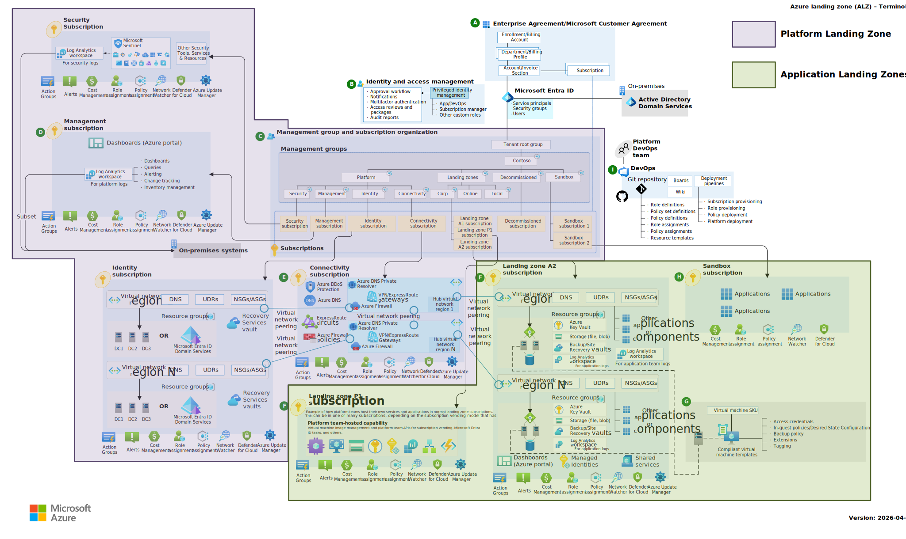
*Sourced from the official [Azure landing zone](https://learn.microsoft.com/en-us/azure/cloud-adoption-framework/ready/landing-zone/?tabs=platvsapp) architecture guidance to show the split in responsibilities between the **Platform Landing Zone** and the **Application Landing Zone**.*

## Contents

- [What I built](#what-i-built)
  - [Subscriptions](#subscriptions)
  - [Single-Region Hub and Spoke Virtual Network](#single-region-hub-and-spoke-virtual-network)
  - [Repo layout (in deployment order)](#repo-layout-in-deployment-order)
- [The AVM modules I used](#the-avm-modules-i-used)
- [Decisions](#decisions)
- [Pipeline](#pipeline)
- [The DDoS policy that broke VNet creation](#the-ddos-policy-that-broke-vnet-creation)
- [Cost Considerations](#cost-considerations)
  - [What it costs (deployed)](#what-it-costs-deployed)
  - [What it would have cost (deliberately not deployed)](#what-it-would-have-cost-deliberately-not-deployed)
- [Useful links](#useful-links)

## What I built

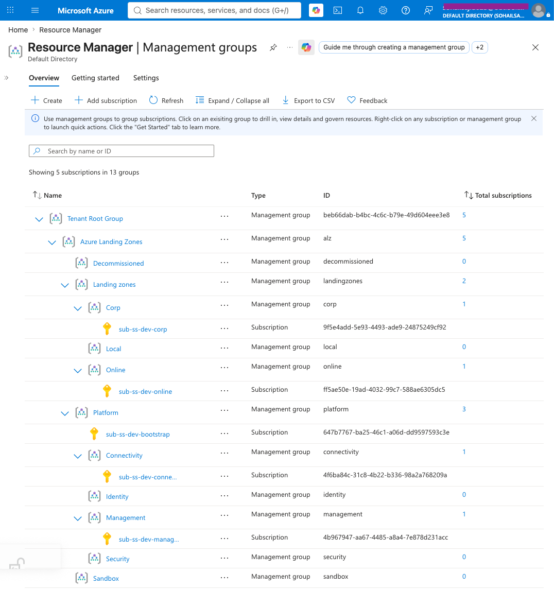
*The full ALZ management group layout with all five subscriptions dropped into place. Identity and Security are there with their policy archetypes but intentionally left empty. Following the [Accelerator docs](https://azure.github.io/Azure-Landing-Zones/accelerator/1_prerequisites/platform-subscriptions), I went with the SMB (Small-Medium Business) scenario to deliver on a cost-optimised deployment.*

```
Tenant Root
└── alz
    ├── platform
    │   ├── (sub-ss-dev-bootstrap) tfstate storage + pipeline identity
    │   ├── connectivity (sub-ss-dev-connectivity) hub VNet (10.10.0.0/16) + 89 private DNS zones
    │   ├── management (sub-ss-dev-management) log analytics, automation, 3 DCRs, AMA identity
    │   ├── identity (MG pre-staged)
    │   └── security (MG pre-staged)
    ├── landingzones
    │   ├── corp (sub-ss-dev-corp) internal spoke, 10.20.0.0/16
    │   └── online (sub-ss-dev-online) internet-facing spoke, 10.30.0.0/16
    └── sandbox / decommissioned
```

### Subscriptions
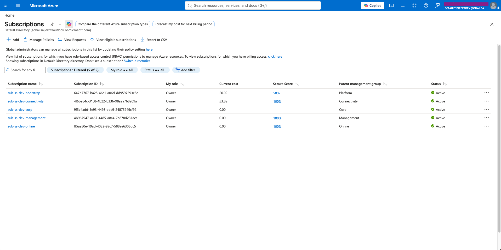

### Single-Region Hub and Spoke Virtual Network
The network is a single-region (UK South) hub-and-spoke: one hub VNet in the
connectivity subscription, two spoke VNets in their own landing zone
subscriptions, each peered bidirectionally to the hub.

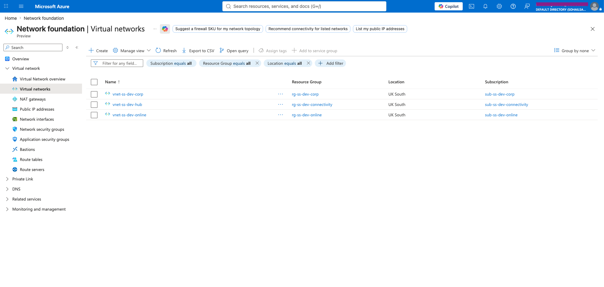

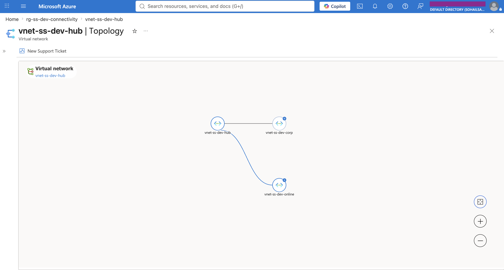

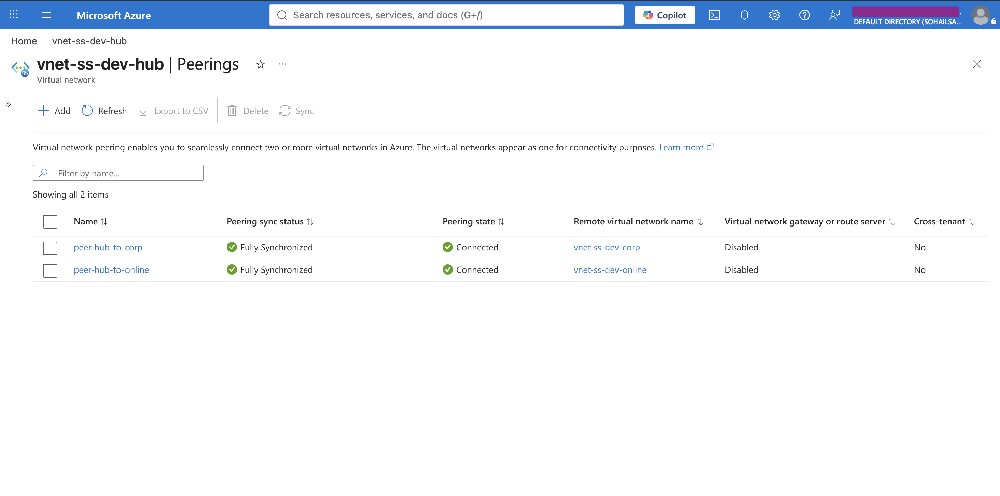
*Both peering legs from the hub's perspective: Fully Synchronised, Connected.*

| VNet | Subscription | Address space | Role |
|---|---|---|---|
| `vnet-ss-dev-hub` | sub-ss-dev-connectivity | 10.10.0.0/16 | Hub: shared services, 89 private link DNS zones |
| `vnet-ss-dev-corp` | sub-ss-dev-corp | 10.20.0.0/16 | Corp archetype: internal-facing workloads |
| `vnet-ss-dev-online` | sub-ss-dev-online | 10.30.0.0/16 | Online archetype: internet-facing workloads (App Gateway subnet pre-staged) |

Non-overlapping /16s per network, /24 subnets carved inside, 10.40.x.x reserved
for future spokes. Corp and Online are classic ALZ archetypes, and the difference is *governance posture*; corp's management group carries the everything-private policies
(`Deploy-Private-DNS-Zones` lives there), online expects controlled public
ingress, which is why the App Gateway + WAF code lives in that spoke. Same
hub, same peering, different law.

Spoke-to-spoke traffic has no path by design: peering isn't transitive, and
there's no central router to bridge it. In the full accelerator scenario an
Azure Firewall in the hub plays that role; mine is toggled
off (because it costs ~£700+ a month), so the spokes are isolated from each other.

Architecturally this maps to the accelerator's
[single-region hub-and-spoke VNet scenario](https://azure.github.io/Azure-Landing-Zones/accelerator/starter-terraform/scenarios/single-region-hub-and-spoke-vnet-with-azure-firewall/)
minus the Azure Firewall, except I didn't run the accelerator: the layers
are hand-composed from the same AVM modules the accelerator generates.

### Repo layout (in deployment order)

1. `bootstrap/` - state storage + pipeline identity (remote state)
2. `platform/management-groups/` - ALZ hierarchy + policy archetypes
3. `platform/subscriptions/` - subscription vending + MG placement
4. `platform/connectivity/` - hub VNet + private DNS zones
5. `platform/management/` - log analytics, automation, DCRs
6. `application-landing-zones/corp/` - corp spoke
7. `application-landing-zones/online/` - online spoke + App Gateway coded
8. `.github/workflows` - plan-on-pr/ gated apply-on-main

*One terraform state file per layer in the bootstrap storage account within the sub-ss-dev-bootstrap subscription.*
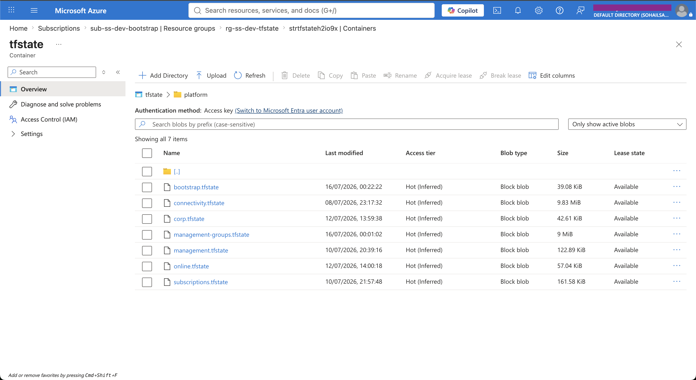

## The AVM modules I used

**Pattern modules** (`avm-ptn-*`) built the platform. They’re opinionated by design, straight from Microsoft’s ALZ blueprint, so they’re perfect for stamping out the core landing zone the “Microsoft way.”

**Resource modules** (`avm-res-*`) built the spokes, where I wanted less magic and more control. They let me shape the workloads exactly how I wanted without the heavy ALZ scaffolding.

| Module | Layer | Why |
|---|---|---|
| [`avm-ptn-alz`](https://registry.terraform.io/modules/Azure/avm-ptn-alz/azurerm/latest) | management-groups | The entire ALZ hierarchy + policy library in one module, with `policy_assignments_to_modify` for overriding defaults, which I needed twice |
| [`avm-ptn-alz-sub-vending`](https://registry.terraform.io/modules/Azure/lz-vending/azurerm/latest) | subscriptions | Creates subscriptions from an MCA (Microsoft Customer Agreement) billing scope and places them into MGs. |
| [`avm-ptn-alz-connectivity-hub-and-spoke-vnet`](https://registry.terraform.io/modules/Azure/avm-ptn-alz-connectivity-hub-and-spoke-vnet/azurerm/latest) | connectivity | Hub + the 89-zone private link DNS estate, with per-category `enabled_resources` toggles. |
| [`avm-ptn-alz-management`](https://registry.terraform.io/modules/Azure/avm-ptn-alz-management/azurerm/latest) | management | Log Analytics + automation + DCRs + the AMA identity in one shot |
| [`avm-res-network-virtualnetwork`](https://registry.terraform.io/modules/Azure/avm-res-network-virtualnetwork/azurerm/latest) | corp, online | VNet + subnets + peering. Killer feature: `create_reverse_peering = true` creates both legs, including the hub-side one in a *different subscription* - from a single block |
| [`avm-res-network-applicationgateway`](https://registry.terraform.io/modules/Azure/avm-res-network-applicationgateway/azurerm/latest) + [`avm-res-network-applicationgatewaywebapplicationfirewallpolicy`](https://registry.terraform.io/modules/Azure/avm-res-network-applicationgatewaywebapplicationfirewallpolicy/azurerm/latest) | online | Coded, schema-validated, **never applied** — behind `deploy_app_gateway = false` (~£300/month when enabled) |

## Decisions

**DDoS Network Protection: not deployed because it costs ~£2,300 a month.** Instead of deleting the `Enable-DDoS-VNET` assignment, I set it to `DoNotEnforce` and the compliance dashboard shows the VNets as non-compliant for DDoS, **deliberate gap** rather than a deleted guardrail.

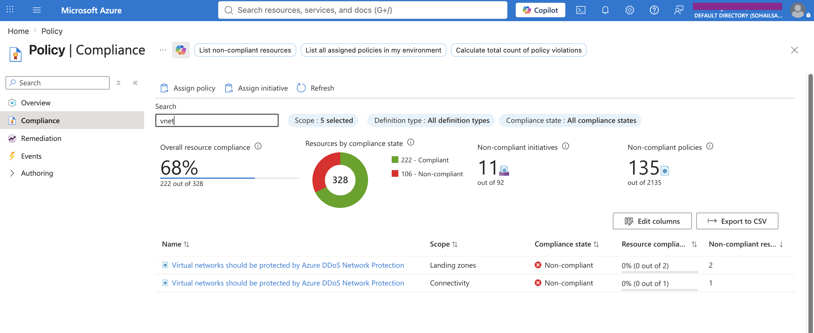

**SMB subscription model: 2 of 4 platform subscriptions.** The [ALZ accelerator prerequisites](https://azure.github.io/Azure-Landing-Zones/accelerator/1_prerequisites/platform-subscriptions/) recommend four platform subscriptions (Management, Connectivity, Identity, Security), but define an explicit SMB minimum: for the [SMB scenarios](https://azure.github.io/Azure-Landing-Zones/accelerator/starter-terraform/scenarios/#smb-small-medium-business-scenarios), you can start with just Management and Connectivity.

**No firewall, no Bastion, no gateways, no DNS resolver.** Again, this was a cost consideration and all cost toggles in the connectivity module are set to false. The one connectivity feature I did keep is the private DNS zones since the resolver adds nothing without on-prem DNS to forward to.

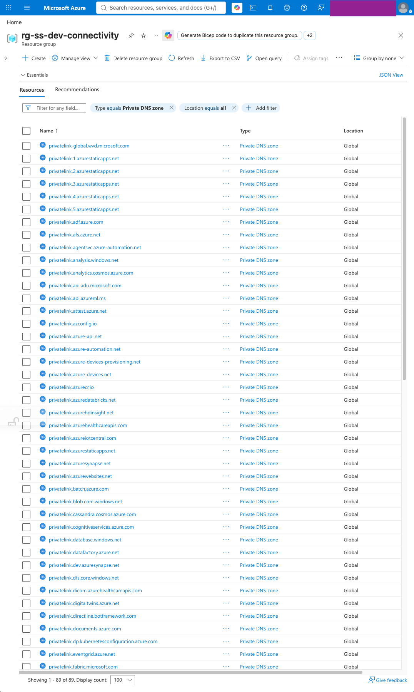

**App Gateway coded but not deployed.** This is behind a `deploy_app_gateway = false` toggle.

**One layer per function.** Bootstrap owns *identity and access* - the SP, all four federated credentials, role assignments. Subscriptions owns *lifecycle and placement*.

Supply-chain posture: after the [March 2026 Trivy supply-chain attack](https://github.com/aquasecurity/trivy/security/advisories/GHSA-69fq-xp46-6x23) in which mutable action tags were force-pushed to credential stealers, I dropped `trivy-action` and instead scan with Checkov, and every `actions/checkout` runs with `persist-credentials: false`.

## Pipeline

[](https://github.com/sohailsajid79/ssdev_azure_landing_zone_avm/actions/workflows/terraform-pipeline.yml)

Plan on PR, apply on merge to main **behind a `prod` environment gate with a required reviewer** (the workflow holds the merges until I approve them). Path-filtered matrix so only changed layers run. `fmt` -> TFLint (azurerm ruleset) -> Checkov -> validate -> plan (posted as a PR comment) -> gated apply.

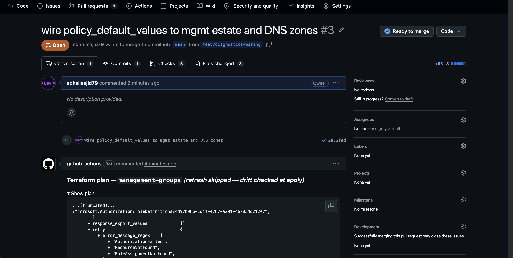

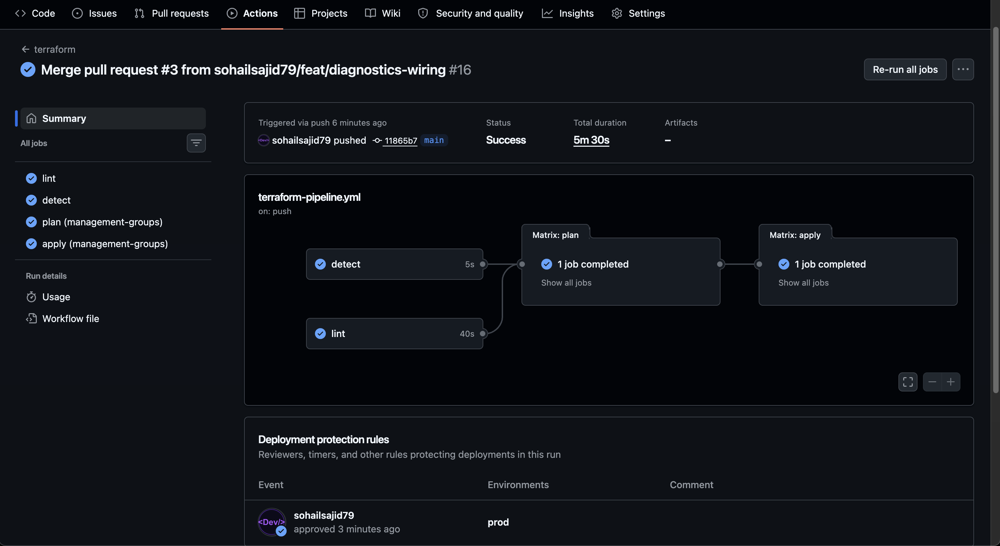

- **PR plans run `-refresh=false`** - skips the state refresh that was getting the SP throttled on management-group reads. The gated apply replans *with* refresh, so drift is caught at the moment before anything ships.
- **`concurrency` group with `cancel-in-progress: false`** - one run at a time, queued not cancelled, because cancelled Terraform runs orphan state locks.
- **`-lock-timeout=5m`** on everything that touches state.
- **Provider caching** - `actions/cache` keyed on `.terraform.lock.hcl` hashes, shared across the matrix.
- Bootstrap is deliberately excluded from the pipeline.

Auth is OIDC end to end - **zero stored secrets**:

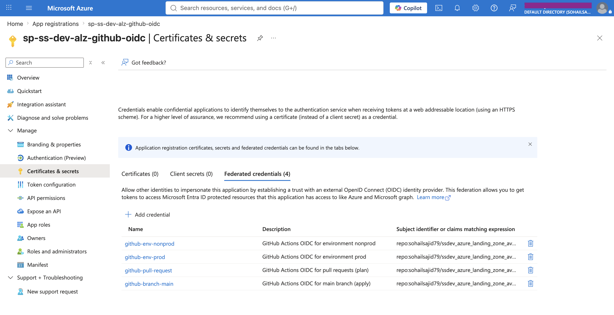

## The DDoS policy that broke VNet creation

The `Enable-DDoS-VNET` assignment (deployed by my management-groups layer, default in the ALZ archetype) carries a **Modify effect**. It rewrites VNet create requests to attach a DDoS plan. With no plan ID supplied, the assignment's parameter contained a placeholder, which Azure rejects!

```json
"ddosPlan": { "value": "/subscriptions/00000000-.../resourceGroups/placeholder/.../ddosProtectionPlans/placeholder" }
```

The ALZ docs tell us to disable this assignment if we don't have a DDoS
plan. And the fix was to set `enforcement_mode = "DoNotEnforce"` via
`policy_assignments_to_modify` in `platform/management-groups/main.tf` - at
**two scopes** because the archetypes assign the same policy at multiple
points in the hierarchy. 

```hcl
policy_assignments_to_modify = {
  connectivity = {
    policy_assignments = {
      Enable-DDoS-VNET = { enforcement_mode = "DoNotEnforce" }
    }
  }
  landingzones = {
    policy_assignments = {
      Enable-DDoS-VNET = { enforcement_mode = "DoNotEnforce" }
    }
  }
}
```


## Cost Considerations

### What it costs (deployed)

| Component | Cost |
|---|---|
| Hub + 2 spokes + peerings | £0 — peering bills per GB; no workload traffic yet |
| 89 private DNS zones + hub estate | ~£30 |
| Log Analytics (PerGB2018, 1 GB/day cap, 30-day retention) | ~£0 at idle |
| Management groups, policies, subscriptions, RBAC, OIDC identity | £0 |

### What it would have cost (deliberately not deployed)

| Component | Cost per month if enabled | Where the toggle lives |
|---|---|---|
| Azure Firewall (Standard) + hub inspection | ~£700+ | connectivity layer, `enabled_resources.firewall` |
| DDoS Network Protection | ~£2,300 | `Enable-DDoS-VNET` policy set to audit-only |
| App Gateway WAF_v2 + WAF policy | ~£300 | online layer, `deploy_app_gateway = false` |
| Private DNS Resolver | ~£130 | connectivity layer, off (no on-prem DNS to forward) |
| Bastion, VPN/ER gateways | ~£100–400 each | connectivity layer, all toggles = false |

## Useful links

- [Azure Verified Modules](https://azure.github.io/Azure-Verified-Modules/)
- [Terraform Registry AVM search](https://registry.terraform.io/search/modules?q=avm)
- [Azure Landing Zones docs + accelerator](https://azure.github.io/Azure-Landing-Zones/)
- [Platform subscriptions guidance](https://azure.github.io/Azure-Landing-Zones/accelerator/1_prerequisites/platform-subscriptions/)
- [Cloud Adoption Framework — landing zones](https://learn.microsoft.com/azure/cloud-adoption-framework/ready/landing-zone/)
- [ALZ policy library](https://github.com/Azure/Azure-Landing-Zones-Library) (`platform/alz/2026.04.2`)
- [azurerm provider OIDC auth](https://registry.terraform.io/providers/hashicorp/azurerm/latest/docs/guides/service_principal_oidc)
- [GitHub OIDC hardening](https://docs.github.com/actions/deployment/security-hardening-your-deployments/about-security-hardening-with-openid-connect)
- [Terraform Pattern Modules](https://azure.github.io/Azure-Verified-Modules/indexes/terraform/tf-pattern-modules/)